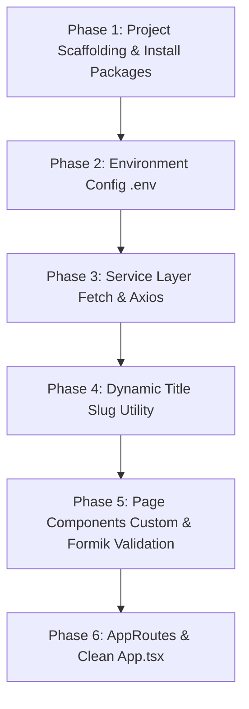

# React Mock API Call, Routing & Validation Cheatsheet

This comprehensive guide walks you through building a production-grade React application with **React Router v7**, environment variables in **Vite**, **Dynamic Title URLs**, **Custom Form Validation vs Formik + Yup**, and full **GET**, **POST**, **PUT**, and **DELETE** API calls using both **Native Fetch API** and **Axios**.

---

## 1. Form Validation Options: Custom vs Formik + Yup vs React Hook Form + Zod

| Feature | Custom Validation (No Packages) | Formik + Yup | React Hook Form + Zod |
| :--- | :--- | :--- | :--- |
| **Best For** | Live interviews when third-party libraries are prohibited to test raw React state skills. | Traditional enterprise apps with complex nested form schemas. | Modern, high-performance applications with minimal re-renders. |
| **Dependencies** | Zero (`npm 0`) | `formik` + `yup` | `react-hook-form` + `zod` |
| **Schema Definition** | Custom function (`validateForm()`) | `Yup.object({...})` | `z.object({...})` |
| **State Handling** | Controlled state (`useState`) | Controlled state (`useFormik`) | Uncontrolled (Ref-based) |

---

## 2. Approach 1: Custom Form Validation (Vanilla React)

Use this pattern when interviewers ask: *"Implement form validation without using any third-party form packages."*

```tsx
import { useState, type FormEvent } from 'react';

interface FormErrors {
  title?: string;
  body?: string;
}

export const CustomFormExample = () => {
  const [title, setTitle] = useState('');
  const [body, setBody] = useState('');
  const [errors, setErrors] = useState<FormErrors>({});
  const [touched, setTouched] = useState<{ title?: boolean; body?: boolean }>({});

  const validate = (t: string, b: string): FormErrors => {
    const errs: FormErrors = {};
    if (!t.trim()) errs.title = 'Title is required.';
    else if (t.trim().length < 5) errs.title = 'Title must be at least 5 characters.';

    if (!b.trim()) errs.body = 'Body is required.';
    else if (b.trim().length < 10) errs.body = 'Body must be at least 10 characters.';

    return errs;
  };

  const handleBlur = (field: 'title' | 'body') => {
    setTouched((prev) => ({ ...prev, [field]: true }));
    setErrors(validate(title, body));
  };

  const handleSubmit = (e: FormEvent) => {
    e.preventDefault();
    setTouched({ title: true, body: true });
    const errs = validate(title, body);
    setErrors(errs);

    if (Object.keys(errs).length === 0) {
      console.log('Form Submitted!', { title, body });
    }
  };

  return (
    <form onSubmit={handleSubmit} noValidate>
      <div>
        <label>Title</label>
        <input
          value={title}
          onChange={(e) => {
            setTitle(e.target.value);
            if (touched.title) setErrors(validate(e.target.value, body));
          }}
          onBlur={() => handleBlur('title')}
          className={touched.title && errors.title ? 'input-error' : ''}
        />
        {touched.title && errors.title && <span className="error-text">{errors.title}</span>}
      </div>

      <div>
        <label>Body</label>
        <textarea
          value={body}
          onChange={(e) => {
            setBody(e.target.value);
            if (touched.body) setErrors(validate(title, e.target.value));
          }}
          onBlur={() => handleBlur('body')}
          className={touched.body && errors.body ? 'input-error' : ''}
        />
        {touched.body && errors.body && <span className="error-text">{errors.body}</span>}
      </div>

      <button type="submit">Submit</button>
    </form>
  );
};
```

---

## 3. Approach 2: Formik + Yup Schema Validation

Use this pattern when interviewers ask for standard library-based form validation.

### Step 1: Install Dependencies
```bash
npm install formik yup
```

### Step 2: Implementation (`src/pages/PostFormikPage.tsx`)

```tsx
import { useFormik } from 'formik';
import * as Yup from 'yup';

// 1. Define Yup Schema
const PostSchema = Yup.object({
  title: Yup.string()
    .trim()
    .min(5, 'Title must be at least 5 characters long.')
    .max(100, 'Title cannot exceed 100 characters.')
    .required('Post title is required.'),
  body: Yup.string()
    .trim()
    .min(10, 'Body content must be at least 10 characters long.')
    .max(1000, 'Body content cannot exceed 1000 characters.')
    .required('Post body content is required.'),
});

export const PostFormikPage = () => {
  // 2. Initialize Formik hook
  const formik = useFormik({
    initialValues: {
      title: '',
      body: '',
    },
    validationSchema: PostSchema,
    onSubmit: async (values) => {
      console.log('Submitting via Formik + Yup:', values);
      // Call API service here (e.g. createPost(values) or updatePost(id, values))
    },
  });

  return (
    <form onSubmit={formik.handleSubmit} noValidate>
      {/* Title Input */}
      <div>
        <label htmlFor="title">Title *</label>
        <input
          id="title"
          name="title"
          type="text"
          value={formik.values.title}
          onChange={formik.handleChange}
          onBlur={formik.handleBlur}
          className={formik.touched.title && formik.errors.title ? 'input-error' : ''}
        />
        {formik.touched.title && formik.errors.title && (
          <span className="error-text">{formik.errors.title}</span>
        )}
      </div>

      {/* Body Textarea */}
      <div>
        <label htmlFor="body">Body *</label>
        <textarea
          id="body"
          name="body"
          rows={5}
          value={formik.values.body}
          onChange={formik.handleChange}
          onBlur={formik.handleBlur}
          className={formik.touched.body && formik.errors.body ? 'input-error' : ''}
        />
        {formik.touched.body && formik.errors.body && (
          <span className="error-text">{formik.errors.body}</span>
        )}
      </div>

      <button type="submit" disabled={formik.isSubmitting}>
        {formik.isSubmitting ? 'Saving...' : 'Submit'}
      </button>
    </form>
  );
};
```

---

## 4. Full Interview Project Setup Flow



### 1. Scaffolding & Packages
```bash
npm create vite@latest SampleApiCall -- --template react-ts
cd SampleApiCall
npm install
npm install axios react-router-dom formik yup
```

### 2. Environment Setup (`.env`)
```env
VITE_API_BASE_URL=https://jsonplaceholder.typicode.com
```

### 3. Service Layer (Fetch & Axios)
- `src/api/fetchService.ts` (GET, GET by ID, POST, PUT, DELETE)
- `src/api/axiosInstance.ts` (Base URL & Interceptors)
- `src/api/axiosService.ts` (GET, GET by ID, POST, PUT, DELETE)

### 4. Dynamic Title Slug Utility (`src/utils/slugify.ts`)
```typescript
export const slugify = (text: string): string =>
  text.toLowerCase().trim().replace(/\s+/g, '-').replace(/[^\w\-]+/g, '').replace(/\-\-+/g, '-');
```

---

## 5. Dynamic URLs: `/posts/:id/:titleSlug`

In `AppRoutes.tsx`:
```tsx
<Route path="posts/:id/:titleSlug" element={<PostDetailPage />} />
```

In `PostListPage.tsx`:
```tsx
<Link to={`/posts/${post.id}/${slugify(post.title)}`}>
  View Details
</Link>
```

In `PostDetailPage.tsx`:
```tsx
const { id, titleSlug } = useParams<{ id: string; titleSlug: string }>();
```

---

## 6. Common Errors and Solutions

| Error | Root Cause | Solution |
| :--- | :--- | :--- |
| `TypeError: Cannot read properties of undefined` | Rendering API response before `fetch` resolves. | Add loading state guard: `if (loading) return <p>Loading...</p>;` |
| Infinite Re-render Loop | Missing dependency array in `useEffect`. | Pass proper dependency array: `useEffect(() => {}, [apiMode]);` |
| CORS Error | Domain mismatch between frontend and API server. | Configure `server.proxy` in `vite.config.ts`. |
| 404 on Browser Refresh | Dev server looking for file path instead of `index.html`. | Client-side routing fallback rule in server config. |
| Formik fields not updating | Missing `name="fieldName"` attribute on inputs. | Ensure input `name` matches Formik `initialValues` key name. |
| `TS1484: type-only import` | `verbatimModuleSyntax` enabled in `tsconfig.json`. | Use `import type { Post } from '../types/post';` |
