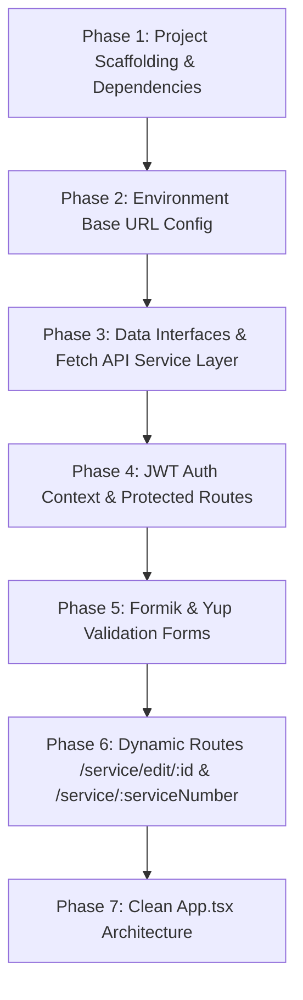

# ServiceFrontend API Integration, Authentication & Routing Cheatsheet

A complete, step-by-step guide explaining how the `ServiceFrontend` React application is built, how **JWT Authentication**, **Native Fetch API**, **Formik & Yup Validation**, and **Dynamic Routing** work together, along with common errors and their exact solutions.

---

## 1. Project Creation & Setup Workflow (Interview Flow)

Follow this exact 7-phase step-by-step workflow when building a full-stack React CRUD application with Authentication in an interview.



### Phase 1: Project Scaffolding & Dependencies
```bash
# 1. Create React + TypeScript project with Vite
npm create vite@latest ServiceFrontend -- --template react-ts

# 2. Navigate to project root
cd ServiceFrontend

# 3. Install core dependencies (React Router, Formik, Yup)
npm install
npm install react-router-dom formik yup
```

---

### Phase 2: Environment Base Path Configuration (`.env`)

Create `.env` in `ServiceFrontend/.env`:
```env
VITE_API_BASE_URL=http://localhost:5090/api
```

Create `src/vite-env.d.ts` for TypeScript autocompletion:
```typescript
/// <reference types="vite/client" />

interface ImportMetaEnv {
  readonly VITE_API_BASE_URL: string;
}

interface ImportMeta {
  readonly env: ImportMetaEnv;
}
```

---

### Phase 3: Data Interfaces & Fetch API Service Layer

#### 1. Data Models (`src/types/service.ts`)
```typescript
export interface ApiResponse<T> {
  isSuccess: boolean;
  statusCode: number;
  message: string;
  data: T;
  totalRecords?: number;
}

export interface LoginRequest {
  userName: string;
  password: string;
}

export interface ServiceItem {
  serviceID: number;
  serviceNumber: string;
  serviceName: string;
  servicePrice: number;
  serviceDuration: number;
}

export interface AddEditServiceRequest {
  serviceID: number;
  serviceName: string;
  servicePrice: number;
  serviceDuration: number;
}
```

#### 2. Native Fetch API Layer (`src/api/fetchService.ts`)
```typescript
import type { ApiResponse, LoginRequest, ServiceItem, AddEditServiceRequest } from '../types/service';

const BASE_URL = import.meta.env.VITE_API_BASE_URL;

const getHeaders = (token?: string, includeContentType = true): HeadersInit => {
  const headers: Record<string, string> = { accept: '*/*' };
  if (includeContentType) headers['Content-Type'] = 'application/json';
  
  const authToken = token || localStorage.getItem('authToken');
  if (authToken) headers['Authorization'] = `Bearer ${authToken}`;
  
  return headers;
};

export const fetchService = {
  // 1. Login API (POST /api/Auth/login)
  async login(credentials: LoginRequest): Promise<ApiResponse<any>> {
    const res = await fetch(`${BASE_URL}/Auth/login`, {
      method: 'POST',
      headers: getHeaders(undefined, true),
      body: JSON.stringify(credentials),
    });
    const data = await res.json();
    if (!res.ok || !data.isSuccess) throw new Error(data.message || 'Login failed');
    return data;
  },

  // 2. GetAllServices API (GET /api/Service/GetAllServices)
  async getAllServices(searchText = '', pageNumber = 1, pageSize = 10): Promise<ApiResponse<ServiceItem[]>> {
    const query = new URLSearchParams({ searchText, pageNumber: pageNumber.toString(), pageSize: pageSize.toString() });
    const res = await fetch(`${BASE_URL}/Service/GetAllServices?${query}`, {
      method: 'GET',
      headers: getHeaders(undefined, false),
    });
    const data = await res.json();
    if (!res.ok || !data.isSuccess) throw new Error(data.message || 'Failed to fetch services');
    return data;
  },

  // 3. GetServiceById API (GET /api/Service/GetServiceById?id=...)
  async getServiceById(id: number | string): Promise<ApiResponse<ServiceItem>> {
    const res = await fetch(`${BASE_URL}/Service/GetServiceById?id=${id}`, {
      method: 'GET',
      headers: getHeaders(undefined, false),
    });
    const data = await res.json();
    if (!res.ok || !data.isSuccess) throw new Error(data.message || 'Failed to fetch service');
    return data;
  },

  // 4. AddEditService API (POST /api/Service/AddEditService)
  async addEditService(payload: AddEditServiceRequest): Promise<ApiResponse<number>> {
    const res = await fetch(`${BASE_URL}/Service/AddEditService`, {
      method: 'POST',
      headers: getHeaders(undefined, true),
      body: JSON.stringify(payload),
    });
    const data = await res.json();
    if (!res.ok || !data.isSuccess) throw new Error(data.message || 'Failed to save service');
    return data;
  },

  // 5. DeleteService API (DELETE /api/Service/DeleteService?id=...)
  async deleteService(id: number | string): Promise<ApiResponse<boolean>> {
    const res = await fetch(`${BASE_URL}/Service/DeleteService?id=${id}`, {
      method: 'DELETE',
      headers: getHeaders(undefined, false),
    });
    const data = await res.json();
    if (!res.ok || !data.isSuccess) throw new Error(data.message || 'Failed to delete service');
    return data;
  },
};
```

---

### Phase 4: Authentication State & Protected Routes

#### Auth Context (`src/context/AuthContext.tsx`):
- Stores JWT token & username in `localStorage`.
- Auto-injects `Authorization: Bearer ${token}` header for all API calls.

#### Route Guard (`src/components/ProtectedRoute.tsx`):
```tsx
import type { ReactNode } from 'react';
import { Navigate, useLocation } from 'react-router-dom';
import { useAuth } from '../context/AuthContext';

export const ProtectedRoute = ({ children }: { children: ReactNode }) => {
  const { isAuthenticated } = useAuth();
  const location = useLocation();

  if (!isAuthenticated) {
    return <Navigate to="/login" state={{ from: location }} replace />;
  }
  return <>{children}</>;
};
```

---

### Phase 5: Formik & Yup Validation Implementation

#### 1. Login Form Validation (`src/pages/LoginPage.tsx`):
```typescript
import { useFormik } from 'formik';
import * as Yup from 'yup';

const LoginSchema = Yup.object({
  userName: Yup.string().trim().min(3, 'Username must be at least 3 characters.').required('Username is required.'),
  password: Yup.string().min(4, 'Password must be at least 4 characters.').required('Password is required.'),
});
```

#### 2. Service Add/Edit Form Validation (`src/pages/ServiceFormPage.tsx`):
```typescript
import { useFormik } from 'formik';
import * as Yup from 'yup';

const ServiceSchema = Yup.object({
  serviceName: Yup.string().trim().min(2, 'Service name must be at least 2 characters.').required('Service name is required.'),
  servicePrice: Yup.number().typeError('Price must be a number.').min(1, 'Price must be greater than 0.').required('Price is required.'),
  serviceDuration: Yup.number().typeError('Duration must be a number.').min(1, 'Duration must be at least 1 minute.').required('Duration is required.'),
});
```

---

### Phase 6: Client-Side Routes & Dynamic URLs

Centralized Route Definitions in `src/routes/AppRoutes.tsx`:

```tsx
import { Routes, Route, Navigate } from 'react-router-dom';
import { Layout } from '../components/Layout';
import { ProtectedRoute } from '../components/ProtectedRoute';
import { LoginPage } from '../pages/LoginPage';
import { ServiceListPage } from '../pages/ServiceListPage';
import { ServiceDetailPage } from '../pages/ServiceDetailPage';
import { ServiceFormPage } from '../pages/ServiceFormPage';

export const AppRoutes = () => {
  return (
    <Routes>
      {/* Public Login Route */}
      <Route path="/login" element={<LoginPage />} />

      {/* Protected Routes Wrapper */}
      <Route path="/" element={<ProtectedRoute><Layout /></ProtectedRoute>}>
        <Route index element={<Navigate to="/service" replace />} />
        
        {/* Services Directory */}
        <Route path="service" element={<ServiceListPage />} />

        {/* Create Service */}
        <Route path="service/new" element={<ServiceFormPage />} />

        {/* Dynamic Edit Route: /service/edit/[id] */}
        <Route path="service/edit/:id" element={<ServiceFormPage />} />

        {/* Dynamic Detail Route: /service/[ServiceNumber] */}
        <Route path="service/:serviceNumber" element={<ServiceDetailPage />} />

        <Route path="*" element={<Navigate to="/service" replace />} />
      </Route>
    </Routes>
  );
};
```

---

### Phase 7: Clean `App.tsx` Architecture

```tsx
import { BrowserRouter } from 'react-router-dom';
import { AuthProvider } from './context/AuthContext';
import { AppRoutes } from './routes/AppRoutes';
import './App.css';

function App() {
  return (
    <BrowserRouter>
      <AuthProvider>
        <AppRoutes />
      </AuthProvider>
    </BrowserRouter>
  );
}

export default App;
```

---

## 2. Dynamic URLs: How They Work

### 1. Dynamic Edit Route (`/service/edit/[id]`)
- Route definition: `<Route path="service/edit/:id" element={<ServiceFormPage />} />`
- Navigating from list: `<Link to={`/service/edit/${service.serviceID}`}>Edit</Link>`
- Parameter reading in `ServiceFormPage.tsx`:
  ```typescript
  const { id } = useParams<{ id?: string }>();
  const isEditMode = Boolean(id);
  // If edit mode: calls fetchService.getServiceById(id) and populates Formik values.
  ```

### 2. Dynamic Detail Route (`/service/[ServiceNumber]`)
- Route definition: `<Route path="service/:serviceNumber" element={<ServiceDetailPage />} />`
- Navigating from list: `navigate(`/service/${service.serviceNumber}`, { state: { service } })`
- Parameter reading in `ServiceDetailPage.tsx`:
  ```typescript
  const { serviceNumber } = useParams<{ serviceNumber: string }>();
  // Displays detail breakdown for matching service code
  ```

---

## 3. Common Errors & Solutions (Troubleshooting Guide)

### Error 1: `401 Unauthorized` on API Calls
* **Symptom:** All `/api/Service/*` calls fail with status `401 Unauthorized`.
* **Cause:** Missing `Authorization: Bearer <TOKEN>` header in fetch request or expired token in `localStorage`.
* **Solution:**
  Ensure token is saved on login and passed in headers:
  ```typescript
  headers['Authorization'] = `Bearer ${localStorage.getItem('authToken')}`;
  ```

---

### Error 2: `400 Bad Request` on `AddEditService` Call
* **Symptom:** Submitting service form fails with `400 Bad Request` or validation error from C# backend.
* **Cause:** Sending `servicePrice` or `serviceDuration` as string values instead of numbers, or passing null `serviceID`.
* **Solution:**
  Cast form values to numbers before payload submission:
  ```typescript
  await fetchService.addEditService({
    serviceID: isEditMode && id ? Number(id) : 0, // Must be 0 for new record
    serviceName: values.serviceName,
    servicePrice: Number(values.servicePrice),
    serviceDuration: Number(values.serviceDuration),
  });
  ```

---

### Error 3: CORS Error on Local API (`http://localhost:5090`)
* **Symptom:** Browser console blocks request: `Access to fetch at 'http://localhost:5090/api/...' from origin 'http://localhost:5173' has been blocked by CORS policy`.
* **Cause:** C# ASP.NET Core backend does not allow CORS requests from Vite frontend dev server origin.
* **Solution:**
  1. **In Backend (C# `Program.cs`):** Add `builder.Services.AddCors(...)` and `app.UseCors(...)`.
  2. **Or In Vite (`vite.config.ts`):** Configure dev proxy:
     ```typescript
     export default defineConfig({
       server: {
         proxy: {
           '/api': {
             target: 'http://localhost:5090',
             changeOrigin: true,
           }
         }
       }
     });
     ```

---

### Error 4: Formik Form Fields Not Updating or Errors Not Displaying
* **Symptom:** Typing in input field does not update form state, or validation messages fail to display below inputs.
* **Cause:** Missing `name="fieldName"` attribute on input element or mismatched name key between HTML input and Formik `initialValues`.
* **Solution:**
  Ensure input `name`, `id`, `value`, `onChange`, and `onBlur` map to Formik:
  ```tsx
  <input
    id="serviceName"
    name="serviceName"
    value={formik.values.serviceName}
    onChange={formik.handleChange}
    onBlur={formik.handleBlur}
  />
  {formik.touched.serviceName && formik.errors.serviceName && (
    <span className="error-text">{formik.errors.serviceName}</span>
  )}
  ```

---

### Error 5: Edit Form Pre-fill Data Mismatch (`TypeError: Cannot read properties of undefined`)
* **Symptom:** Opening edit form `/service/edit/10` shows empty input fields or throws error before data finishes loading.
* **Cause:** Formik initialized with empty initial values before `getServiceById` promise resolves.
* **Solution:**
  Enable `enableReinitialize: true` in `useFormik`:
  ```typescript
  const formik = useFormik({
    initialValues: { serviceName: '', servicePrice: 0, serviceDuration: 0 },
    enableReinitialize: true,
    onSubmit: async (values) => { ... }
  });
  ```

---

### Error 6: 404 Page Not Found on Direct Browser Refresh
* **Symptom:** Navigating to `/service/edit/10` or `/service/SRV004` works fine via links, but browser refresh (F5) throws server 404 error.
* **Cause:** Web server looks for file on disk instead of routing to `index.html`.
* **Solution:**
  Vite handles client-side routing fallback out of the box in development. For production servers (Nginx/Apache), configure fallback rewrite rule to `index.html`.

---

### Error 7: TypeScript `TS1484: 'ReactNode' is a type and must be imported using a type-only import`
* **Symptom:** `npm run build` fails with `TS1484` compilation error.
* **Cause:** `verbatimModuleSyntax` is enabled in `tsconfig.json`.
* **Solution:**
  Use `import type`:
  ```typescript
  import type { ReactNode } from 'react';
  ```

---

## 4. Summary Checklist for Technical Interview

1. **Scaffold & Packages:** `npm create vite@latest ServiceFrontend -- --template react-ts` && `npm install react-router-dom formik yup`
2. **Environment:** Set `VITE_API_BASE_URL=http://localhost:5090/api` in `.env`
3. **Fetch API:** Centralize all 5 backend endpoints in `src/api/fetchService.ts`
4. **Auth Flow:** Store JWT token in `localStorage`, manage via `AuthContext.tsx`, protect routes via `ProtectedRoute.tsx`
5. **Form Validation:** Use `useFormik` & `Yup.object` for Login and Add/Edit forms
6. **Dynamic Routing:** Route `/service/edit/:id` for editing, route `/service/:serviceNumber` for details
7. **Clean App.tsx:** Wrap `AppRoutes` in `AuthProvider` and `BrowserRouter` with zero inline UI logic in `App.tsx`
